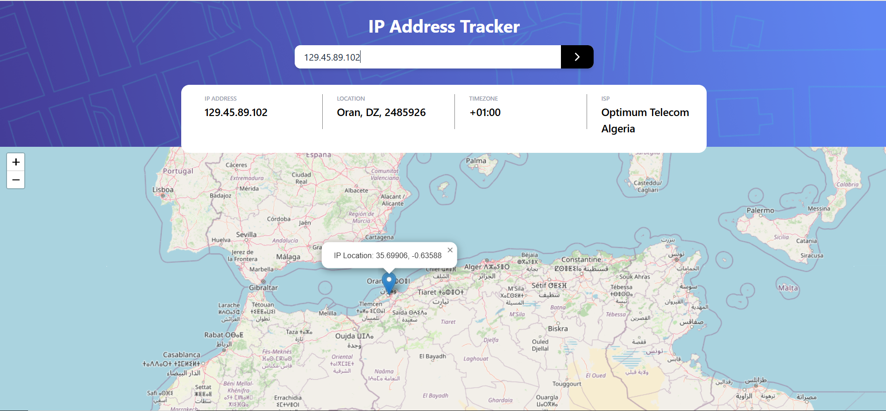

# 🌐 Frontend Mentor - IP Address Tracker Solution
This is my solution to the IP Address Tracker challenge on Frontend Mentor.
Frontend Mentor challenges help you build real-world projects to improve your frontend development skills.

## 📑 Table of Contents
- 📌 Overview

- ✅ The Challenge

- 📸 Screenshot

- 🔗 Links

- 🛠️ My Process

- 🔧 Built With

- 📚 What I Learned

- 👨‍💻 Author

## 📌 Overview
✅ The Challenge
Users should be able to:

View the IP address, location, timezone, and ISP for any searched IP or domain

View the user's own IP address information on initial load

See the data displayed on an interactive map

Have a responsive layout on all screen sizes

See proper hover and focus states for interactive elements

## 📸 Screenshot

## 🔗 Links
🔧 Solution Code: GitHub Repository

🌐 Live Site: Live Demo (replace with actual deployed link)

## 🛠️ My Process

### 🔧 Built With

- ⚛️ React + TypeScript

- ⚡️ Vite for fast build and dev environment

- 💅 Tailwind CSS for utility-first styling

- 🗺 Leaflet.js for interactive maps

- 🌍 Geo.IPify API for fetching IP geolocation data

- 📱 Mobile-first responsive layout

## 📚 What I Learned
How to fetch and handle data from external APIs with React and TypeScript

Working with Leaflet.js to render dynamic map locations

Handling responsive layout and UI logic with Tailwind CSS

Managing state and form input handling in React

## 👨‍💻 Author
🌐 Website – hamzapab.netlify.app

🐙 GitHub – [@Hamzapab](https://github.com/Hamzapab)

🧑‍🏫 Frontend Mentor – [@Hamzapab](https://www.frontendmentor.io/profile/Hamzapab)

